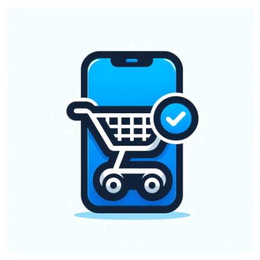
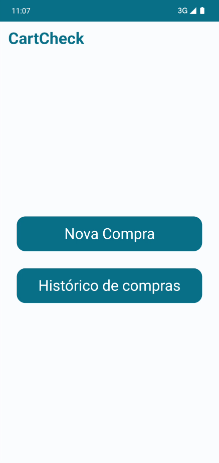
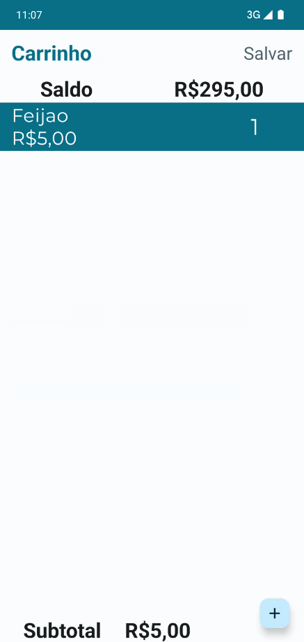
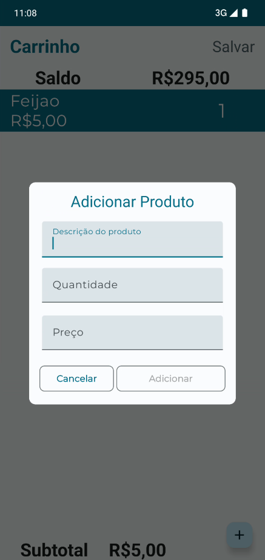
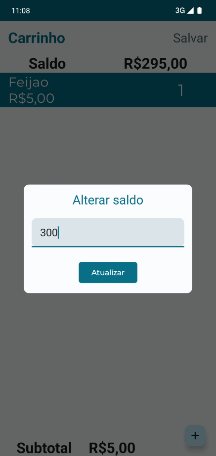
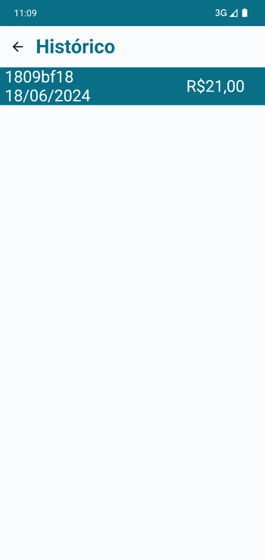
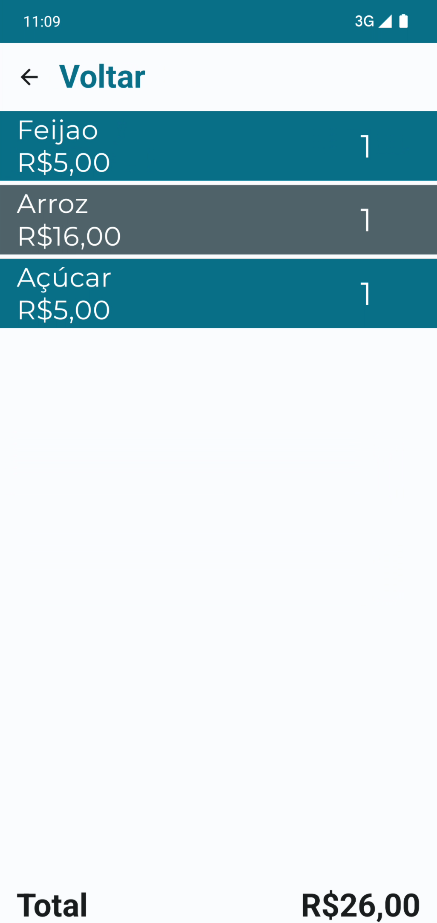

#  Cart Check

___

### Torne suas compras no supermercado simples e econômicas com CartCheck

O CartCheck é um aplicativo intuitivo e prático que ajuda você a controlar seus gastos enquanto faz
suas compras no supermercado. Ideal para quem deseja manter o orçamento sob controle e evitar
surpresas na hora de pagar. Com funcionalidades avançadas, o CartCheck é o seu companheiro
indispensável para economizar tempo e dinheiro.
___

### Funcionalidades principais:

* Adição de Itens Rápida e Fácil.
* Atualização de Preços em Tempo Real: Veja os preços atualizados de cada item e o total das suas
  compras em tempo real.
* Histórico de Compras:Acesse o histórico das suas compras anteriores para acompanhar seus gastos ao
  longo do tempo.

### Beneficios:

* Controle Financeiro: Mantenha suas finanças em ordem, monitorando seus gastos em tempo real.
* Transforme suas idas ao supermercado em uma experiência organizada e econômica. Baixe agora o
  CartCheck e descubra como é fácil controlar seus gastos enquanto faz suas compras!

&nbsp;

&nbsp;
**Capturas de tela**

